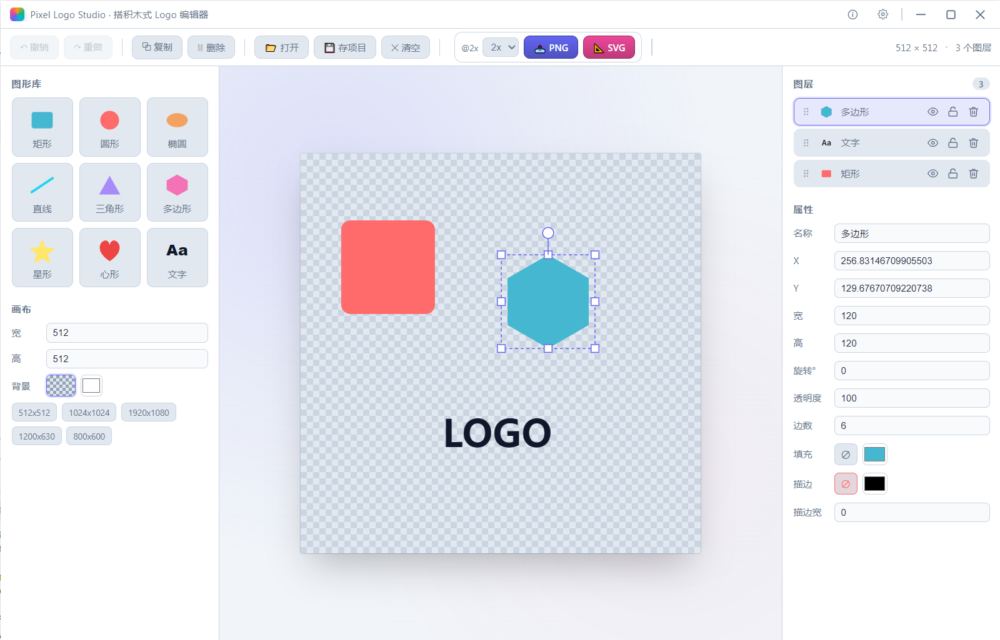

<div align="center">

# Pixel Logo Studio

**一款搭积木式的桌面端 Logo 编辑器。**  
用基础图形拼搭 Logo，画布背景透明，可导出清晰的 PNG 与 SVG。

[English](./README.md) · 简体中文

</div>

---

## ✨ 功能特性

- **搭积木式设计** — 从左侧图形库拖拽（或点击）9 种基元到画布任意位置：矩形、圆形、椭圆、直线、三角形、多边形、星形、心形（路径）、文字。
- **完整变换** — 点选拖动移动；8 向缩放手柄；顶部旋转杆旋转（Shift 吸附 15°）；方向键微调 1px（Shift = 10px）。
- **图层面板** — 拖拽排序、显示/隐藏（👁）、锁定（🔒）、删除；四档层级按钮（到底层 / 下移 / 上移 / 到顶层）。
- **属性面板** — 名称、X/Y、宽高、旋转、透明度、圆角（矩形）、角数与内径比（星形）、边数（多边形）、文字 / 字号 / 字重 / 字体 / 对齐、填充色、描边色与宽度。
- **多选对齐** — 同时选中 ≥ 2 个图形时，一键左对齐 / 水平居中 / 右对齐 / 顶对齐 / 垂直居中 / 底对齐。
- **背景透明** — UI 用棋盘格提示透明；导出时 PNG 保留 alpha 通道，SVG 不带任何背景矩形。
- **导出**
  - **PNG** — 通过浏览器内 Canvas 以 1× / 2× / 3× / 4× 超采样渲染，再交给 Go 后端弹出原生保存对话框写盘（含 PNG 魔数校验）。
  - **SVG** — 直接从内存中的形状树序列化；矢量无损，可无限缩放。
- **项目持久化** — 保存 / 打开 `.pixel.json` 项目文件以便后续编辑；编辑器状态还会自动缓存到 `localStorage`。
- **撤销 / 重做** — 50 步历史栈（Ctrl+Z / Ctrl+Shift+Z / Ctrl+Y）。
- **画布预设** — 512²、1024²、1920×1080、1200×630、800×600，以及自定义宽高与透明 / 纯色背景切换。
- **双模式运行** — 既可作为 Wails 桌面应用启动；前端也可单独 `npm run dev` 启动，在 Go 后端缺失时自动降级为浏览器下载方式。
- **浅色 / 深色主题** — 在设置对话框中一键切换浅色与深色外观；选择自动保存到 `localStorage`。
- **中英文切换** — 完整的英文与简体中文本地化；随时在设置对话框中切换界面语言。
- **自定义标题栏** — 无边框窗口配全自定义标题栏：拖拽移动、双击最大化 / 还原、原生风格的最小化 / 最大化 / 关闭按钮。

## 🧱 技术栈

| 层 | 技术 |
|------|------|
| 桌面外壳 | [Wails v2](https://wails.io) v2.13.0（Go 1.22+） |
| 原生对话框 / 文件读写 | Go（`runtime.SaveFileDialog`、`os.WriteFile`） |
| 前端 | Vue 3.5 + TypeScript + Vite 6 |
| 状态管理 | Pinia 2 |
| 渲染 | SVG DOM（可编辑）→ Canvas（PNG 导出） |

## 📁 项目结构

```
pixel/
├── main.go                 # Wails 入口（embed frontend/dist、窗口配置）
├── app.go                  # Go 后端：SavePngDataUrl / SaveSvg / SaveProjectJson / LoadProjectJson
├── go.mod / go.sum
├── wails.json              # 产品名与构建配置
├── build/bin/pixel.exe     # 构建产物
└── frontend/
    ├── package.json        # Vue 3.5 + Pinia 2.3 + nanoid 5 + Vite 6
    ├── vite.config.ts      # @ → src 别名
    └── src/
        ├── main.ts / App.vue / styles/main.css   # 主题感知三栏布局
        ├── types/shapes.ts                       # Shape 联合类型（9 种）
        ├── store/editor.ts                       # Pinia：50 步 undo/redo、对齐、导入导出
        ├── composables/useTheme.ts               # 主题状态 + 持久化
        ├── i18n/                                 # en.ts / zh-CN.ts / index.ts / types.ts —— 中英文 UI
        ├── utils/
        │   ├── shapeFactory.ts    # createShape（每种图形默认参数与颜色轮换）
        │   ├── svgRender.ts       # shape -> SVG 片段（polygon/star/path 自动生成点）
        │   ├── exportSvg.ts       # 组合为完整合法 SVG（xmlns + viewBox + 可选背景 rect）
        │   └── svgToPng.ts        # SVG Blob -> Image -> Canvas.toDataURL('image/png')，天然透明
        ├── wails/bindings.ts      # 存在 window.go.main.App 时走原生，否则降级浏览器下载
        └── components/
            ├── TitleBar.vue       # 自定义无边框标题栏：拖拽、双击最大化、窗口控件
            ├── Toolbar.vue        # 撤销重做 / 复制删除 / 打开存项目 / 清空 / 1-4x 缩放 / PNG SVG 导出
            ├── ShapePanel.vue     # 3 列图标库（可点击可拖拽）；画布宽高 / 背景 / 尺寸预设
            ├── EditorCanvas.vue   # SVG 画布：hit-area 点击 / 移动 / 8 向缩放 / 旋转 / 键盘 / 拖放
            ├── RightPanel.vue     # 图层列表（拖拽排序）+ 多选对齐 + 属性面板
            ├── SettingsDialog.vue # 主题切换、语言切换
            └── AboutDialog.vue    # 关于信息、项目链接
```

## 🚀 快速开始

### 环境要求

- [Go](https://go.dev/dl/) 1.22+
- [Node.js](https://nodejs.org/) 18+（已在 v26 验证）
- [Wails CLI](https://wails.io/docs/gettingstarted/installation) v2 — `go install github.com/wailsapp/wails/v2/cmd/wails@latest`
- Windows：WebView2 运行时（Windows 11 已预装）

### 安装与运行（桌面开发模式）

```bash
# 在项目根目录
$env:GOPROXY = "https://goproxy.cn,direct"   # Windows PowerShell；*nix 用 export
wails dev
```

### 仅前端开发（浏览器预览）

```bash
cd frontend
npm install
npm run dev
# 打开 http://127.0.0.1:5173
```

Go 后端缺失时，编辑器自动降级为浏览器文件对话框：导出触发 `<a download>` 下载，"打开项目"使用 `<input type="file">`。

### 生产构建

```bash
$env:GOPROXY = "https://goproxy.cn,direct"
wails build
# 产物：build/bin/pixel.exe
```

## ⌨️ 快捷键

| 动作 | 快捷键 |
|------|------|
| 撤销 | `Ctrl+Z` |
| 重做 | `Ctrl+Shift+Z` / `Ctrl+Y` |
| 全选 | `Ctrl+A` |
| 复制 | `Ctrl+D` |
| 删除 | `Delete` / `Backspace` |
| 微调 1px | `↑` `↓` `←` `→` |
| 微调 10px | `Shift` + 方向键 |
| 旋转吸附 15° | `Shift` + 拖动旋转手柄 |
| 等比缩放 | `Shift` + 拖动四角手柄 |
| 加选 | `Shift` / `Ctrl` / `⌘` + 点击 |

## 🎯 透明背景的实现要点

1. **UI 层** — SVG 画布下方用 CSS 棋盘格提示透明；当 `canvas.background === 'transparent'` 时 SVG 本身不带背景元素。
2. **SVG 导出** — 仅当用户选择了具体背景色才追加底层 `<rect>`；透明时不写 → SVG 天然透明。
3. **PNG 导出** — `new Image()` 加载 SVG Blob → `ctx.clearRect` 清空 Canvas（= 透明）→ `drawImage` 光栅化 → `toDataURL('image/png')` 产出带 alpha 的透明 PNG。
4. **校验** — Go 后端写盘前检查 PNG 8 字节魔数（`89 50 4E 47 0D 0A 1A 0A`），损坏的内容不会落到磁盘。

## 🖼️ 软件截图

> 

## 支持项目

如果这个项目对你有帮助，欢迎请我喝杯咖啡 ☕

<table>
  <tr>
    <td>
      
    </td>
    <td width="100" align="center" > 🙏 </td>
    <td>
      
    </td>
  </tr>
</table>

也可以通过 [OpenCollective](https://opencollective.com/sandhope) 支持项目。
